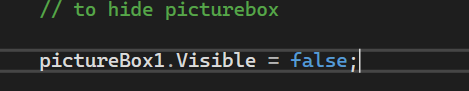
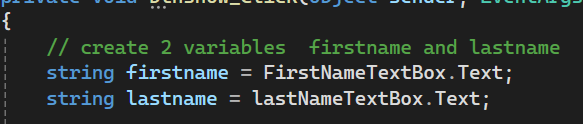
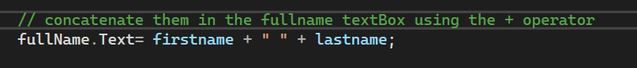
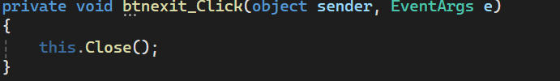

# week2 practice

## Overview 

this practice covers how to :
-hide a picture box using visible property 
-create variables
-concatenate 2 variables 
-close windows form 

## Hide a picturebox

we use picturebox to import image and ".visible" property to control whether a picturebox appears on the  windows from

Syntax:
pictureboxName.visible= false;   // to hide picturebox

## create variable 

we create 3 variables to store user`s info 
firstName stores user firstname 
lastname stores user lastname 

## join 2 variables

and this variable 'fullname' stores complete user`s name after combine the two variables  firstname and lastname using the + operator

##close form 

the close() method is used to close the current windows form and when the user clicks Exitbtn , the form will close .

 

